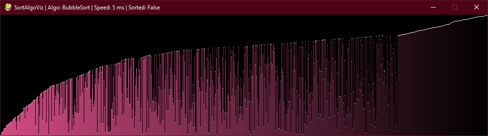
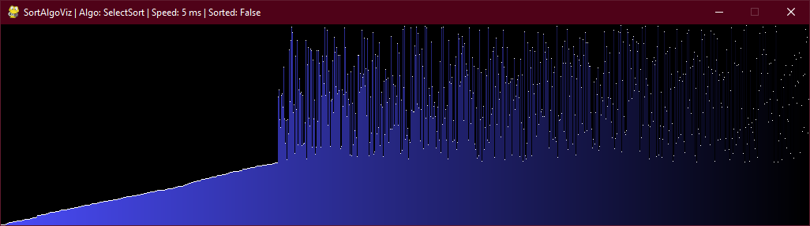

## SortAlgoViz

This program helps vizualize sorting algorithms (with KEYGEN music playing in the background). Wow! So original! Yeah...not so creative, huh? But I really wanted to create it for a long time. And, honestly, I don't regret it. I kinda looks cool. Plus, it has pixel-perfection. That is, the program plots the array as a graph on an array of scaled pixels. Some screenshots:

#### Unsorted Array:

#### Bubble Sorting:

#### Selection Sorting:

